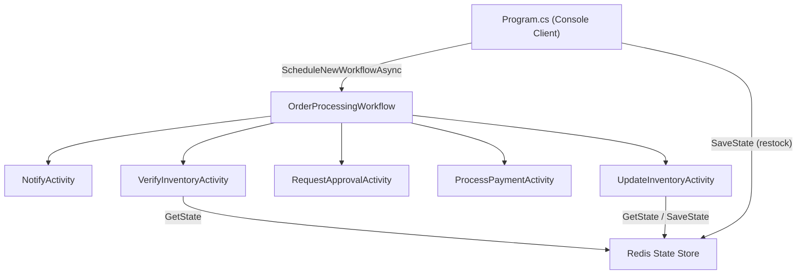
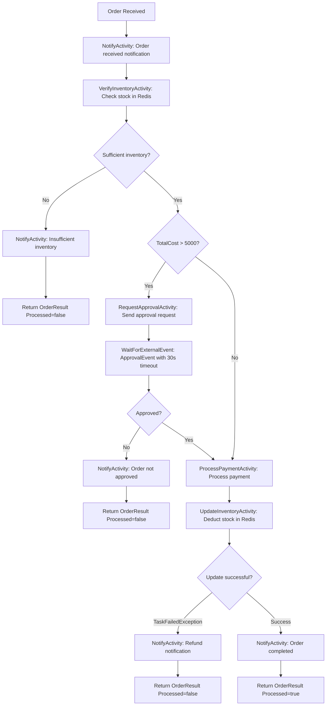

# Order Processing Workflow -- Business Flow Documentation

## 1. Overview

This project is a **Dapr Workflow** application built with .NET 10 that implements an **order processing pipeline**. It uses Redis as a state store for inventory management and orchestrates five workflow activities through a central workflow definition (`OrderProcessingWorkflow`).

The application is a console app (`order-processor`) that:

1. Restocks inventory in a Redis state store.
2. Constructs an order payload.
3. Schedules and monitors a Dapr workflow that processes the order through multiple stages.

---

## 2. Architecture



### Key Components

| Component | File | Role |
|---|---|---|
| Entry Point | `Program.cs` | Restocks inventory, creates order, schedules and monitors workflow |
| Workflow Orchestrator | `Workflows/OrderProcessingWorkflow.cs` | Coordinates the sequence of activities and decision logic |
| Notify Activity | `Activities/NotifyActivity.cs` | Logs notifications to the user at various stages |
| Verify Inventory Activity | `Activities/VerifyInventoryActivity.cs` | Checks Redis state store for available stock |
| Request Approval Activity | `Activities/RequestApprovalActivity.cs` | Sends approval request for high-value orders |
| Process Payment Activity | `Activities/ProcessPaymentActivity.cs` | Processes and authorizes payment |
| Update Inventory Activity | `Activities/UpdateInventoryActivity.cs` | Deducts purchased quantity from Redis state store |
| Data Models | `Models.cs` | Record types for all request/response payloads |
| State Store Config | `components/state_redis.yaml` | Dapr component config for Redis on `localhost:6379` |
| Dapr Multi-App Config | `dapr.yaml` | Defines the `order-processor` app for `dapr run -f .` |

---

## 3. Data Models

All models are defined as C# records in `Models.cs`:

| Record | Fields | Purpose |
|---|---|---|
| `OrderPayload` | `Name` (string), `TotalCost` (double), `Quantity` (int, default 1) | Input to the workflow -- describes what the customer wants to buy |
| `InventoryRequest` | `RequestId` (string), `ItemName` (string), `Quantity` (int) | Request sent to `VerifyInventoryActivity` |
| `InventoryResult` | `Success` (bool), `OrderPayload` (nullable) | Response from inventory verification |
| `ApprovalRequest` | `RequestId` (string), `ItemBeingPurchased` (string), `Quantity` (int), `Amount` (double) | Request sent to `RequestApprovalActivity` for high-value orders |
| `ApprovalResponse` | `RequestId` (string), `IsApproved` (bool) | External event payload received for approval decisions |
| `PaymentRequest` | `RequestId` (string), `ItemBeingPurchased` (string), `Amount` (int), `Currency` (double) | Request sent to `ProcessPaymentActivity` and `UpdateInventoryActivity` |
| `OrderResult` | `Processed` (bool) | Final output of the workflow |

---

## 4. Business Flow Diagram



---

## 5. Workflow Execution Paths

### Path 1 -- Insufficient Inventory (Fail Fast)

| Step | Activity | Description |
|------|----------|-------------|
| 1 | `NotifyActivity` | Logs that the order was received with order ID, quantity, item name, and total cost. |
| 2 | `VerifyInventoryActivity` | Queries Redis for the item. If the item does not exist in the state store or the available quantity is less than the requested quantity, returns `InventoryResult(Success=false)`. |
| 3 | `NotifyActivity` | Logs "Insufficient inventory for {item}". |
| 4 | -- | Workflow returns `OrderResult(Processed=false)`. |

### Path 2 -- High-Value Order Rejected (Approval Denied or Timeout)

| Step | Activity | Description |
|------|----------|-------------|
| 1 | `NotifyActivity` | Logs that the order was received. |
| 2 | `VerifyInventoryActivity` | Inventory check passes (sufficient stock available). |
| 3 | `RequestApprovalActivity` | Order `TotalCost > 5000` triggers an approval request. The activity simulates sending the request (2-second delay). |
| 4 | `WaitForExternalEvent` | Workflow pauses and waits for an external `ApprovalEvent` with a **30-second timeout**. |
| 5 | `NotifyActivity` | If not approved (or timeout expires), logs "Order {orderId} was not approved". |
| 6 | -- | Workflow returns `OrderResult(Processed=false)`. |

### Path 3 -- Payment Processed but Inventory Update Fails (Refund)

| Step | Activity | Description |
|------|----------|-------------|
| 1 | `NotifyActivity` | Logs that the order was received. |
| 2 | `VerifyInventoryActivity` | Inventory check passes. |
| 3 | *(optional)* `RequestApprovalActivity` | If `TotalCost > 5000`, approval is requested and granted. |
| 4 | `ProcessPaymentActivity` | Payment is processed successfully (7-second simulated delay). |
| 5 | `UpdateInventoryActivity` | Re-reads the state store and finds insufficient stock (possible race condition). Throws `InvalidOperationException`. |
| 6 | Caught as `TaskFailedException` | The workflow catches the failure. |
| 7 | `NotifyActivity` | Logs "Order {orderId} Failed! You are now getting a refund". |
| 8 | -- | Workflow returns `OrderResult(Processed=false)`. |

### Path 4 -- Happy Path (Order Completed Successfully)

| Step | Activity | Description |
|------|----------|-------------|
| 1 | `NotifyActivity` | Logs order received notification. |
| 2 | `VerifyInventoryActivity` | Inventory is sufficient (2-second simulated delay). |
| 3 | *(optional)* `RequestApprovalActivity` | If `TotalCost > 5000`, approval is requested and granted. |
| 4 | `ProcessPaymentActivity` | Payment processed successfully (7-second simulated delay). |
| 5 | `UpdateInventoryActivity` | Deducts the purchased quantity from the Redis state store and saves the updated inventory (5-second simulated delay). |
| 6 | `NotifyActivity` | Logs "Order {orderId} has completed!". |
| 7 | -- | Workflow returns `OrderResult(Processed=true)`. |

---

## 6. Activity Details

### NotifyActivity

- **Input:** `Notification` (contains a `Message` string)
- **Output:** None (returns null)
- **Behavior:** Logs the notification message. Used at multiple points in the workflow to inform the user of progress, failures, and completion.

### VerifyInventoryActivity

- **Input:** `InventoryRequest` (RequestId, ItemName, Quantity)
- **Output:** `InventoryResult` (Success flag + current OrderPayload from store)
- **Behavior:**
  - Reads the item from the Redis state store using `DaprClient.GetStateAndETagAsync`.
  - If the item is not found in the store, returns `InventoryResult(false, null)`.
  - If the available quantity is greater than or equal to the requested quantity, returns success with the current order payload.
  - Otherwise, returns failure.
  - Includes a 2-second simulated processing delay on success.

### RequestApprovalActivity

- **Input:** `ApprovalRequest` (RequestId, ItemBeingPurchased, Quantity, Amount)
- **Output:** None (returns null)
- **Behavior:**
  - Logs the approval request.
  - Simulates sending the approval request with a 2-second delay.
  - The actual approval response comes as an **external event** (`ApprovalEvent`) that the workflow waits for separately.

### ProcessPaymentActivity

- **Input:** `PaymentRequest` (RequestId, ItemBeingPurchased, Amount, Currency)
- **Output:** None (returns null)
- **Behavior:**
  - Logs the payment processing details.
  - Simulates payment processing with a 7-second delay.
  - Logs successful payment confirmation.

### UpdateInventoryActivity

- **Input:** `PaymentRequest` (RequestId, ItemBeingPurchased, Amount, Currency)
- **Output:** None (returns null)
- **Behavior:**
  - Reads the current inventory from Redis state store.
  - Calculates `newQuantity = currentQuantity - purchasedAmount`.
  - If `newQuantity < 0`, throws `InvalidOperationException` (caught as `TaskFailedException` by the workflow, triggering refund path).
  - Otherwise, saves the updated inventory back to the Redis state store.
  - Includes a 5-second simulated processing delay.

---

## 7. Default Execution Configuration

As configured in `Program.cs`:

| Setting | Value |
|---|---|
| Item | Cars |
| Quantity | 1 |
| TotalCost | $5,000 |
| Pre-stocked Inventory | 10 Cars at $50,000 |
| State Store | `statestore` (Redis on localhost:6379) |

Since `TotalCost` is exactly 5000 (not **greater than** 5000), the approval path is **skipped** in the default run. The workflow follows the happy path: notify, verify inventory, process payment, update inventory, notify completion.

---

## 8. Infrastructure

- **Dapr Sidecar:** Manages workflow orchestration, state persistence, and activity scheduling via gRPC.
- **Redis:** Used as the state store (`statestore` component). Configured in `components/state_redis.yaml` on `localhost:6379` with no password. Also serves as the actor state store.
- **Dapr Multi-App Run:** Configured in `dapr.yaml` to run the `order-processor` app with `dotnet run`.
- **Observability:** Zipkin integration available at `http://localhost:9411` for viewing workflow trace spans.

### How to Run

```bash
cd ./order-processor
dotnet restore
dotnet build
cd ..
dapr run -f .
```

### How to Stop

```bash
dapr stop -f .
```
