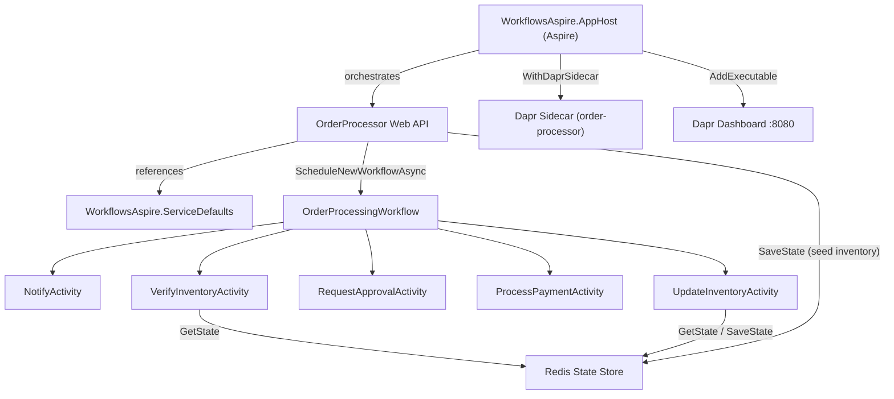
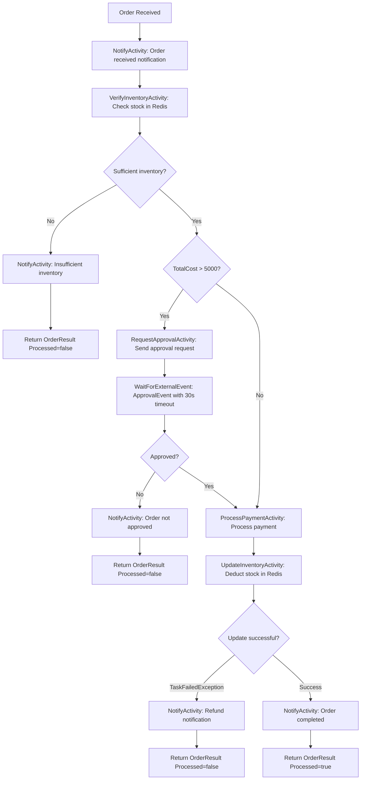

# Order Processing Workflow -- Business Flow Documentation

## 1. Overview

This project is a **Dapr Workflow** Web API built with .NET 10 that implements an **order processing pipeline**. It uses Redis as a state store for inventory management and orchestrates five workflow activities through a central workflow definition (`OrderProcessingWorkflow`).

The application is a minimal API (`order-processor`) orchestrated by **.NET Aspire** that exposes two HTTP endpoints:

- **POST /orders** -- Seeds inventory and schedules a new order workflow.
- **GET /orders/{orderId}** -- Checks the status of an existing workflow.

The solution includes **Scalar** for interactive API documentation (available at `/scalar/v1` in development) and **OpenAPI** document generation (at `/openapi/v1.json`).

---

## 2. Architecture



### Key Components

| Component | File | Role |
|---|---|---|
| Aspire AppHost | `WorkflowsAspire.AppHost/AppHost.cs` | Orchestrates the OrderProcessor with Dapr sidecar and Dapr dashboard |
| Service Defaults | `WorkflowsAspire.ServiceDefaults/Extensions.cs` | Shared Aspire defaults: OpenTelemetry, health checks, service discovery, resilience |
| Web API Entry Point | `OrderProcessor/Program.cs` | Configures services, exposes HTTP endpoints, seeds inventory, schedules workflows |
| Workflow Orchestrator | `OrderProcessor/Workflows/OrderProcessingWorkflow.cs` | Coordinates the sequence of activities and decision logic |
| Notify Activity | `OrderProcessor/Activities/NotifyActivity.cs` | Logs notifications to the user at various stages |
| Verify Inventory Activity | `OrderProcessor/Activities/VerifyInventoryActivity.cs` | Checks Redis state store for available stock |
| Request Approval Activity | `OrderProcessor/Activities/RequestApprovalActivity.cs` | Sends approval request for high-value orders |
| Process Payment Activity | `OrderProcessor/Activities/ProcessPaymentActivity.cs` | Processes and authorizes payment |
| Update Inventory Activity | `OrderProcessor/Activities/UpdateInventoryActivity.cs` | Deducts purchased quantity from Redis state store |
| Data Models | `OrderProcessor/Models.cs` | Record types for all request/response payloads |
| State Store Config | `components/state_redis.yaml` | Dapr component config for Redis on `localhost:6379` |

---

## 3. HTTP API Endpoints

### POST /orders

Accepts an `OrderPayload` JSON body, seeds inventory in Redis, and schedules the `OrderProcessingWorkflow`.

**Request body:**

```json
{
  "name": "Cars",
  "totalCost": 5000,
  "quantity": 1
}
```

**Response:** `202 Accepted` with the generated `orderId`.

### GET /orders/{orderId}

Returns the current workflow status for the given order ID.

**Response:** `200 OK` with `orderId`, `status`, `createdAt`, `lastUpdatedAt` -- or `404 Not Found` if the order does not exist.

---

## 4. Data Models

All models are defined as C# records in `Models.cs`:

| Record | Fields | Purpose |
|---|---|---|
| `OrderPayload` | `Name` (string), `TotalCost` (double), `Quantity` (int, default 1) | Input to the workflow -- describes what the customer wants to buy |
| `InventoryRequest` | `RequestId` (string), `ItemName` (string), `Quantity` (int) | Request sent to `VerifyInventoryActivity` |
| `InventoryResult` | `Success` (bool), `OrderPayload` (nullable) | Response from inventory verification |
| `ApprovalRequest` | `RequestId` (string), `ItemBeingPurchased` (string), `Quantity` (int), `Amount` (double) | Request sent to `RequestApprovalActivity` for high-value orders |
| `ApprovalResponse` | `RequestId` (string), `IsApproved` (bool) | External event payload received for approval decisions |
| `PaymentRequest` | `RequestId` (string), `ItemBeingPurchased` (string), `Amount` (int), `Currency` (double) | Request sent to `ProcessPaymentActivity` and `UpdateInventoryActivity` |
| `OrderResult` | `Processed` (bool) | Final output of the workflow |

---

## 5. Business Flow Diagram



---

## 6. Workflow Execution Paths

### Path 1 -- Insufficient Inventory (Fail Fast)

| Step | Activity | Description |
|------|----------|-------------|
| 1 | `NotifyActivity` | Logs that the order was received with order ID, quantity, item name, and total cost. |
| 2 | `VerifyInventoryActivity` | Queries Redis for the item. If the item does not exist in the state store or the available quantity is less than the requested quantity, returns `InventoryResult(Success=false)`. |
| 3 | `NotifyActivity` | Logs "Insufficient inventory for {item}". |
| 4 | -- | Workflow returns `OrderResult(Processed=false)`. |

### Path 2 -- High-Value Order Rejected (Approval Denied or Timeout)

| Step | Activity | Description |
|------|----------|-------------|
| 1 | `NotifyActivity` | Logs that the order was received. |
| 2 | `VerifyInventoryActivity` | Inventory check passes (sufficient stock available). |
| 3 | `RequestApprovalActivity` | Order `TotalCost > 5000` triggers an approval request. The activity simulates sending the request (2-second delay). |
| 4 | `WaitForExternalEvent` | Workflow pauses and waits for an external `ApprovalEvent` with a **30-second timeout**. |
| 5 | `NotifyActivity` | If not approved (or timeout expires), logs "Order {orderId} was not approved". |
| 6 | -- | Workflow returns `OrderResult(Processed=false)`. |

### Path 3 -- Payment Processed but Inventory Update Fails (Refund)

| Step | Activity | Description |
|------|----------|-------------|
| 1 | `NotifyActivity` | Logs that the order was received. |
| 2 | `VerifyInventoryActivity` | Inventory check passes. |
| 3 | *(optional)* `RequestApprovalActivity` | If `TotalCost > 5000`, approval is requested and granted. |
| 4 | `ProcessPaymentActivity` | Payment is processed successfully (7-second simulated delay). |
| 5 | `UpdateInventoryActivity` | Re-reads the state store and finds insufficient stock (possible race condition). Throws `InvalidOperationException`. |
| 6 | Caught as `TaskFailedException` | The workflow catches the failure. |
| 7 | `NotifyActivity` | Logs "Order {orderId} Failed! You are now getting a refund". |
| 8 | -- | Workflow returns `OrderResult(Processed=false)`. |

### Path 4 -- Happy Path (Order Completed Successfully)

| Step | Activity | Description |
|------|----------|-------------|
| 1 | `NotifyActivity` | Logs order received notification. |
| 2 | `VerifyInventoryActivity` | Inventory is sufficient (2-second simulated delay). |
| 3 | *(optional)* `RequestApprovalActivity` | If `TotalCost > 5000`, approval is requested and granted. |
| 4 | `ProcessPaymentActivity` | Payment processed successfully (7-second simulated delay). |
| 5 | `UpdateInventoryActivity` | Deducts the purchased quantity from the Redis state store and saves the updated inventory (5-second simulated delay). |
| 6 | `NotifyActivity` | Logs "Order {orderId} has completed!". |
| 7 | -- | Workflow returns `OrderResult(Processed=true)`. |

---

## 7. Activity Details

### NotifyActivity

- **Input:** `Notification` (contains a `Message` string)
- **Output:** None (returns null)
- **Behavior:** Logs the notification message. Used at multiple points in the workflow to inform the user of progress, failures, and completion.

### VerifyInventoryActivity

- **Input:** `InventoryRequest` (RequestId, ItemName, Quantity)
- **Output:** `InventoryResult` (Success flag + current OrderPayload from store)
- **Behavior:**
  - Reads the item from the Redis state store using `DaprClient.GetStateAndETagAsync`.
  - If the item is not found in the store, returns `InventoryResult(false, null)`.
  - If the available quantity is greater than or equal to the requested quantity, returns success with the current order payload.
  - Otherwise, returns failure.
  - Includes a 2-second simulated processing delay on success.

### RequestApprovalActivity

- **Input:** `ApprovalRequest` (RequestId, ItemBeingPurchased, Quantity, Amount)
- **Output:** None (returns null)
- **Behavior:**
  - Logs the approval request.
  - Simulates sending the approval request with a 2-second delay.
  - The actual approval response comes as an **external event** (`ApprovalEvent`) that the workflow waits for separately.

### ProcessPaymentActivity

- **Input:** `PaymentRequest` (RequestId, ItemBeingPurchased, Amount, Currency)
- **Output:** None (returns null)
- **Behavior:**
  - Logs the payment processing details.
  - Simulates payment processing with a 7-second delay.
  - Logs successful payment confirmation.

### UpdateInventoryActivity

- **Input:** `PaymentRequest` (RequestId, ItemBeingPurchased, Amount, Currency)
- **Output:** None (returns null)
- **Behavior:**
  - Reads the current inventory from Redis state store.
  - Calculates `newQuantity = currentQuantity - purchasedAmount`.
  - If `newQuantity < 0`, throws `InvalidOperationException` (caught as `TaskFailedException` by the workflow, triggering refund path).
  - Otherwise, saves the updated inventory back to the Redis state store.
  - Includes a 5-second simulated processing delay.

---

## 8. Infrastructure

- **.NET Aspire:** Orchestrates the application via `WorkflowsAspire.AppHost`. Provides the Aspire dashboard for monitoring resources, logs, and traces.
- **Aspire Service Defaults:** `WorkflowsAspire.ServiceDefaults` adds OpenTelemetry (logging, metrics, tracing), health checks (`/health`, `/alive`), service discovery, and HTTP resilience to the OrderProcessor.
- **Dapr Sidecar:** Managed by Aspire via `WithDaprSidecar()` with `AppId = "order-processor"`. Handles workflow orchestration, state persistence, and activity scheduling via gRPC.
- **Dapr Dashboard:** Hosted as an Aspire executable resource on port 8080.
- **Redis:** Used as the state store (`statestore` component). Configured in `components/state_redis.yaml` on `localhost:6379` with no password. Also serves as the actor state store.
- **Scalar:** Interactive API documentation UI available at `/scalar/v1` in development mode.
- **OpenAPI:** Document served at `/openapi/v1.json` in development mode.

### Solution Structure

```
WorkflowsAspire/
  WorkflowsAspire.AppHost/        -- Aspire orchestrator (AppHost.cs)
  WorkflowsAspire.ServiceDefaults/ -- Shared Aspire service defaults
  OrderProcessor/                  -- Dapr Workflow Web API
    Program.cs                     -- Minimal API with endpoints
    Models.cs                      -- Data model records
    Workflows/                     -- Workflow definitions
    Activities/                    -- Workflow activity implementations
  components/                      -- Dapr component configurations
    state_redis.yaml
```

### How to Run

```bash
dotnet run --project WorkflowsAspire.AppHost
```

This starts the Aspire dashboard, the OrderProcessor with its Dapr sidecar, and the Dapr dashboard. The Aspire dashboard URL will be printed to the console.

### How to Test

```bash
# Create a new order
curl -X POST http://localhost:<port>/orders \
  -H "Content-Type: application/json" \
  -d '{"name": "Cars", "totalCost": 5000, "quantity": 1}'

# Check order status
curl http://localhost:<port>/orders/{orderId}
```

Replace `<port>` with the port assigned by Aspire (visible in the Aspire dashboard).

### How to Stop

Stop the Aspire host process (Ctrl+C).
