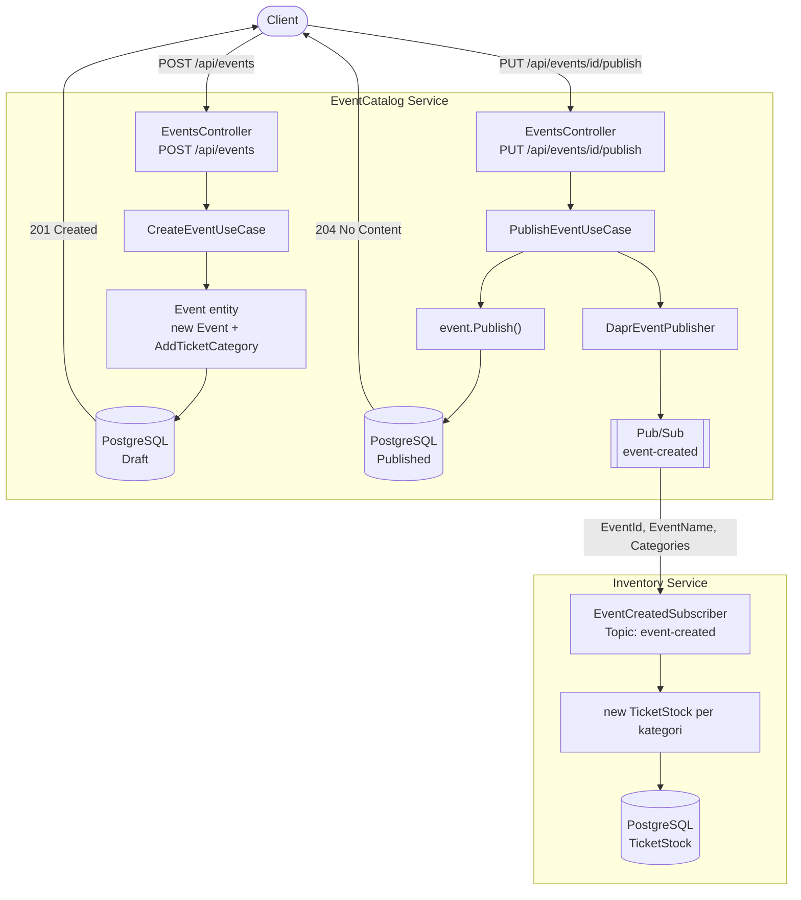
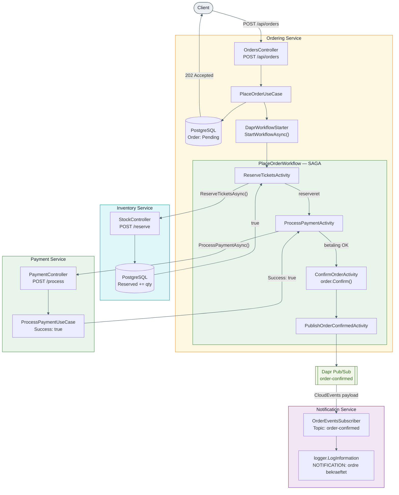
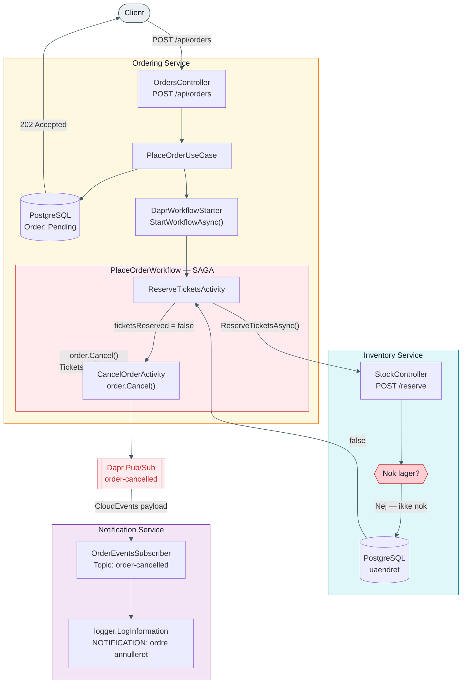
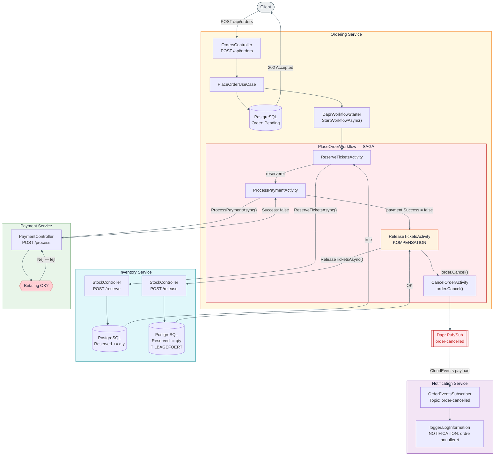

# Flows
## Event oprettelse og publicering

```mermaid
flowchart TD
    Client(["Client"])

    subgraph EC ["EventCatalog Service"]
        A["EventsController\nPOST /api/events"]
        B["CreateEventUseCase"]
        C["Event entity\nnew Event + AddTicketCategory"]
        D[("PostgreSQL\nDraft")]
        E["EventsController\nPUT /api/events/id/publish"]
        F["PublishEventUseCase"]
        G["event.Publish()"]
        H[("PostgreSQL\nPublished")]
        I["DaprEventPublisher"]
        J[["Pub/Sub\nevent-created"]]
    end

    subgraph INV ["Inventory Service"]
        K["EventCreatedSubscriber\nTopic: event-created"]
        L["new TicketStock per kategori"]
        M[("PostgreSQL\nTicketStock")]
    end

    Client -->|POST /api/events| A
    A --> B --> C --> D
    D -->|201 Created| Client

    Client -->|PUT /api/events/id/publish| E
    E --> F --> G --> H
    F --> I --> J
    H -->|204 No Content| Client

    J -->|EventId, EventName, Categories| K
    K --> L --> M

```

## Opret order - happy path

```mermaid
%%{init: {'theme': 'default', 'themeVariables': {'primaryColor': '#E3F2FD', 'primaryTextColor': '#1A2035', 'primaryBorderColor': '#1565C0', 'lineColor': '#455A64', 'secondaryColor': '#F3E5F5', 'tertiaryColor': '#E8F5E9'}}}%%
flowchart TD
    Client(["Client"])

    subgraph ORD ["Ordering Service"]
        A["OrdersController\nPOST /api/orders"]
        B["PlaceOrderUseCase"]
        C[("PostgreSQL\nOrder: Pending")]
        D["DaprWorkflowStarter\nStartWorkflowAsync()"]

        subgraph WF ["PlaceOrderWorkflow — SAGA"]
            W1["ReserveTicketsActivity"]
            W2["ProcessPaymentActivity"]
            W3["ConfirmOrderActivity\norder.Confirm()"]
            W4["PublishOrderConfirmedActivity"]
        end
    end

    subgraph INV ["Inventory Service"]
        I1["StockController\nPOST /reserve"]
        I2[("PostgreSQL\nReserved += qty")]
    end

    subgraph PAY ["Payment Service"]
        P1["PaymentController\nPOST /process"]
        P2["ProcessPaymentUseCase\nSuccess: true"]
    end

    PUB[["Dapr Pub/Sub\norder-confirmed"]]

    subgraph NOT ["Notification Service"]
        N1["OrderEventsSubscriber\nTopic: order-confirmed"]
        N2["logger.LogInformation\nNOTIFICATION: ordre bekraeftet"]
    end

    Client -->|"POST /api/orders"| A
    A --> B
    B --> C
    B --> D
    D --> W1

    W1 -->|"ReserveTicketsAsync()"| I1
    I1 --> I2
    I2 -->|"true"| W1

    W1 -->|"reserveret"| W2
    W2 -->|"ProcessPaymentAsync()"| P1
    P1 --> P2
    P2 -->|"Success: true"| W2

    W2 -->|"betaling OK"| W3
    W3 --> W4
    W4 --> PUB
    PUB -->|"CloudEvents payload"| N1
    N1 --> N2

    C -->|"202 Accepted"| Client

    style Client fill:#ECEFF1,stroke:#455A64,color:#1A2035
    style ORD fill:#FFF8E1,stroke:#F57F17,color:#1A2035
    style WF fill:#E8F5E9,stroke:#2E7D32,color:#1A2035
    style INV fill:#E0F7FA,stroke:#00838F,color:#1A2035
    style PAY fill:#E8F5E9,stroke:#2E7D32,color:#1A2035
    style NOT fill:#F3E5F5,stroke:#6A1B9A,color:#1A2035
    style PUB fill:#F1F8E9,stroke:#33691E,color:#33691E
```

## Opret order - No stock

```mermaid
%%{init: {'theme': 'default', 'themeVariables': {'primaryColor': '#E3F2FD', 'primaryTextColor': '#1A2035', 'primaryBorderColor': '#1565C0', 'lineColor': '#455A64'}}}%%
flowchart TD
    Client(["Client"])

    subgraph ORD ["Ordering Service"]
        A["OrdersController\nPOST /api/orders"]
        B["PlaceOrderUseCase"]
        C[("PostgreSQL\nOrder: Pending")]
        D["DaprWorkflowStarter\nStartWorkflowAsync()"]

        subgraph WF ["PlaceOrderWorkflow — SAGA"]
            W1["ReserveTicketsActivity"]
            W2["CancelOrderActivity\norder.Cancel()"]
        end
    end

    subgraph INV ["Inventory Service"]
        I1["StockController\nPOST /reserve"]
        I2{{"Nok lager?"}}
        I3[("PostgreSQL\nuaendret")]
    end

    PUB[["Dapr Pub/Sub\norder-cancelled"]]

    subgraph NOT ["Notification Service"]
        N1["OrderEventsSubscriber\nTopic: order-cancelled"]
        N2["logger.LogInformation\nNOTIFICATION: ordre annulleret"]
    end

    Client -->|"POST /api/orders"| A
    A --> B
    B --> C
    B --> D
    D --> W1

    W1 -->|"ReserveTicketsAsync()"| I1
    I1 --> I2
    I2 -->|"Nej — ikke nok"| I3
    I3 -->|"false"| W1

    W1 -->|"ticketsReserved = false"| W2
    W2 -->|"order.Cancel()\nTickets not available"| ORD
    W2 --> PUB
    PUB -->|"CloudEvents payload"| N1
    N1 --> N2

    C -->|"202 Accepted"| Client

    style Client fill:#ECEFF1,stroke:#455A64,color:#1A2035
    style ORD fill:#FFF8E1,stroke:#F57F17,color:#1A2035
    style WF fill:#FFEBEE,stroke:#C62828,color:#1A2035
    style INV fill:#E0F7FA,stroke:#00838F,color:#1A2035
    style NOT fill:#F3E5F5,stroke:#6A1B9A,color:#1A2035
    style PUB fill:#FFEBEE,stroke:#C62828,color:#C62828
    style I2 fill:#FFCDD2,stroke:#C62828,color:#1A2035
```
## Opret order - Payment failed

```mermaid
%%{init: {'theme': 'default', 'themeVariables': {'primaryColor': '#E3F2FD', 'primaryTextColor': '#1A2035', 'primaryBorderColor': '#1565C0', 'lineColor': '#455A64'}}}%%
flowchart TD
    Client(["Client"])

    subgraph ORD ["Ordering Service"]
        A["OrdersController\nPOST /api/orders"]
        B["PlaceOrderUseCase"]
        C[("PostgreSQL\nOrder: Pending")]
        D["DaprWorkflowStarter\nStartWorkflowAsync()"]

        subgraph WF ["PlaceOrderWorkflow — SAGA"]
            W1["ReserveTicketsActivity"]
            W2["ProcessPaymentActivity"]
            W3["ReleaseTicketsActivity\nKOMPENSATION"]
            W4["CancelOrderActivity\norder.Cancel()"]
        end
    end

    subgraph INV ["Inventory Service"]
        I1["StockController\nPOST /reserve"]
        I2[("PostgreSQL\nReserved += qty")]
        I3["StockController\nPOST /release"]
        I4[("PostgreSQL\nReserved -= qty\nTILBAGEFOERT")]
    end

    subgraph PAY ["Payment Service"]
        P1["PaymentController\nPOST /process"]
        P2{{"Betaling OK?"}}
    end

    PUB[["Dapr Pub/Sub\norder-cancelled"]]

    subgraph NOT ["Notification Service"]
        N1["OrderEventsSubscriber\nTopic: order-cancelled"]
        N2["logger.LogInformation\nNOTIFICATION: ordre annulleret"]
    end

    Client -->|"POST /api/orders"| A
    A --> B
    B --> C
    B --> D
    D --> W1

    W1 -->|"ReserveTicketsAsync()"| I1
    I1 --> I2
    I2 -->|"true"| W1

    W1 -->|"reserveret"| W2
    W2 -->|"ProcessPaymentAsync()"| P1
    P1 --> P2
    P2 -->|"Nej — fejl"| P1
    P1 -->|"Success: false"| W2

    W2 -->|"payment.Success = false"| W3
    W3 -->|"ReleaseTicketsAsync()"| I3
    I3 --> I4
    I4 -->|"OK"| W3
    W3 --> W4
    W4 -->|"order.Cancel()\nPayment failed"| ORD
    W4 --> PUB
    PUB -->|"CloudEvents payload"| N1
    N1 --> N2

    C -->|"202 Accepted"| Client

    style Client fill:#ECEFF1,stroke:#455A64,color:#1A2035
    style ORD fill:#FFF8E1,stroke:#F57F17,color:#1A2035
    style WF fill:#FFEBEE,stroke:#C62828,color:#1A2035
    style INV fill:#E0F7FA,stroke:#00838F,color:#1A2035
    style PAY fill:#E8F5E9,stroke:#2E7D32,color:#1A2035
    style NOT fill:#F3E5F5,stroke:#6A1B9A,color:#1A2035
    style PUB fill:#FFEBEE,stroke:#C62828,color:#C62828
    style W3 fill:#FFF3E0,stroke:#E65100,color:#1A2035
    style P2 fill:#FFCDD2,stroke:#C62828,color:#1A2035
```
